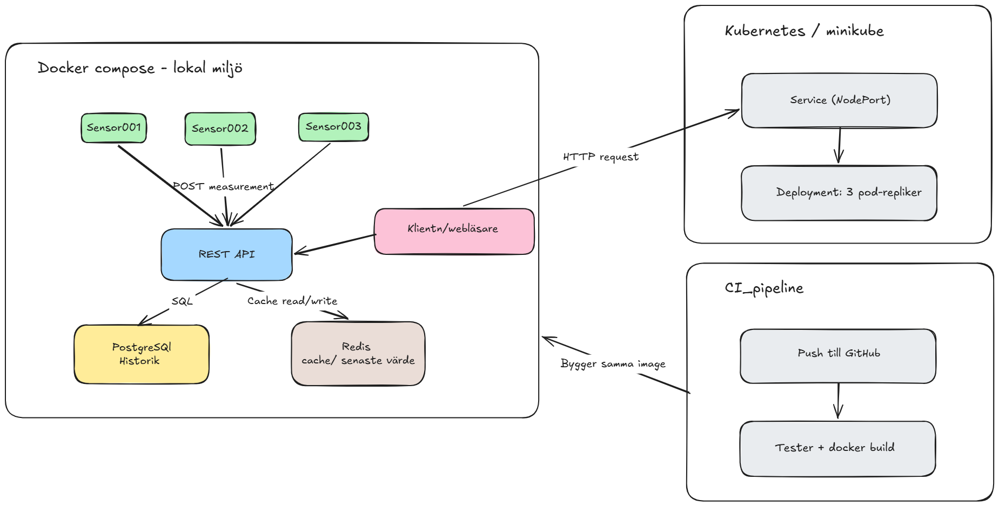

# Arkitekturdiagram – obligatorisk leverabel

## Vad diagram visar

Diagrammet visar att sensorer skickar mätningar till REST API via POST / measurement, därefter valideras alla mätningar och sedan sparar historik i postgreSQL och värdet uppdateras i Redis. Alla de steg sker lokalt via docker compose. 
CI-pipeline kör automatiskt vid varje git push och  kör valideringstester och bygger docker-image för att säkerställa att koden fungerar.